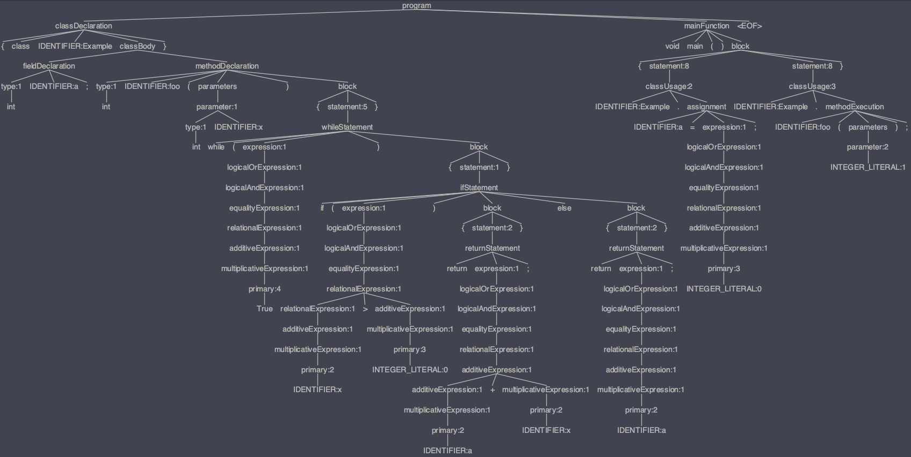

# FOOLI 

FOOLI (Fake Object-Oriented Language with Iteration) - Analisador sintático e gerador de código para uma linguagem de programação

## Desenvolvido por

- Gabriel de Freitas
- Luis Dorr

## Exemplo de entrada
> [Disponível aqui](src/main/resources/input.fooli)

```
{
    class Example

    int a;

    int foo(int x) {
        while(True) {
            if (x > 0) {
                return a + x;
            } else {
                return a;
            }
        }
    }
}

void main() {
    Example.a = 0;
    Example.foo(1);
}
```

## Resultado



```
Tabela de Símbolos:
a : int
Example : class
foo : method: int

Three Address Codes (TAC):
WHILE True DO ...
IF x>0 THEN ...
RETURN a+x
RETURN a
a = 0;
CALL foo 1
```
